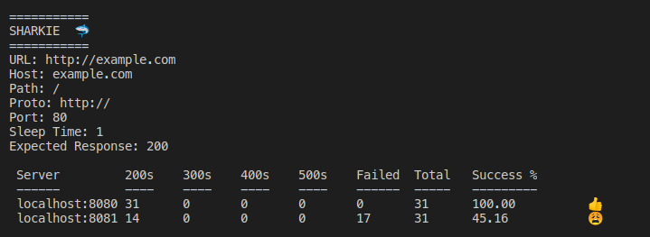

# SHARKIE
Sharkie is a CLI tool to track HTTP response codes from servers behind load balancers.

The quickest way to get started is by using the pre-built docker container:
```
docker run -it --rm registry.gitlab.com/aro5000/sharkie:latest -u http://example.com
```



# Use Cases
This is not an exhaustive list, but some common scenarios where this tool could be helpful.
## Reverse Proxy with TLS Termination:
A typical load balancer setup might look like the following:
```
        https://example.com
            |------|
            |  LB  |
            --------
         /      |     \
   SRV1:80   SRV2:80   SRV3:80
     |---|    |---|     |---|
   10.1.1.1  10.1.1.2  10.1.1.3
```

Sometimes it can be difficult to detect intermittent issues on one of these servers when traffic is primarily going through the load balancer because the system might take nodes out of the mix if they misbehave, or the issue may be intermittent enough that it just translates to every few requests failing for the end user. In the above use case, sharkie could send an HTTP GET request to each one of the individual servers (preserving the host header) and track responses. That command could look like the following:
```
sharkie -u http://example.com -s 10.1.1.1 -s 10.1.1.2 -s 10.1.1.3 -e 200
```
Command breakdown:
```
-u URL (In this case, even though the load balancer listens on :443 HTTPS, the backend listens on port :80 HTTP so we form the URL that way)
-s The IP address or DNS name of the servers
-e Expected response code (this is not necessary, but will help show successful vs. failed requests)
```

## DNS Load Balancing (Multiple Data Centers)
If DNS load balancing is being used, it may be difficult to quickly check which data center, or cloud region might be having issues with a given request.
```
                         (===================================)
                         (DNS Load Balancer / Traffic Manager)
                         (===================================)

    ================================             ================================
    || DC01 :443                  ||             || DC02 :443                  ||
    || https://example.com        ||             || https://example.com        ||
    || 1.2.3.4 - west.company.com ||             || 2.3.4.5 - east.company.com ||
    ================================             ================================
```
The following command could run HTTPS checks against both data centers preserving host headers and SNI without having to tweak the DNS load balancer rules:
```
sharkie -u https://example.com -s west.company.com -s east.company.com -e 200
```

# CLI Flags
The following is the output from ```sharkie -h```
```
Welcome to Sharkie! A CLI tool for tracking HTTP response codes.
Example:
sharkie -u example.com


Use the -s flag to target multiple servers behind a load balancer with the same HTTP Host header:
sharkie -u example.com -s 1.2.3.4 -s 3.4.5.6


Track success rate based on expected status code:
sharkie -u https://example.com -s 1.2.3.4 -s 3.4.5.6 -e 200

  -e int
        Expected HTTP status code to generate success percentages. For example:
        -e 200 (200-299)
        -e 300 (300-399) etc.
        Valid values are: 200, 300, 400, 500
  -emoji
        Control whether emoji's display or not.
        Usage (to turn off): -emoji=false (default true)
  -k    Ignore invalid certificates for TLS connections. (Default is false)
        Usage: -k=true
  -s value
        Server IP or hostname (127.0.0.1, example.com)
  -sleep float
        Time in seconds to sleep between requests (default 1)
  -u string
        URL to target
```

# Build
## From Source:
Make sure you have installed golang [https://golang.org/dl/](https://golang.org/dl/)
```
go build

# You can move the resulting binary anywhere in your path
# For example:
mv ./sharkie ~/.local/bin
```

## Docker:
The easiest way to use sharkie without installing golang is with Docker:
```
docker build -t sharkie .
docker run -it --rm sharkie -u example.com
```

# Background
I'm trying to learn golang and this is one of my first projects with it! I've made similar ad-hoc tools while troubleshooting using python or curl loops, but this consolidates my most frequently used options and allows me to quickly make concurrent requests with goroutines. I'm very open to PR's/MR's to help improve!